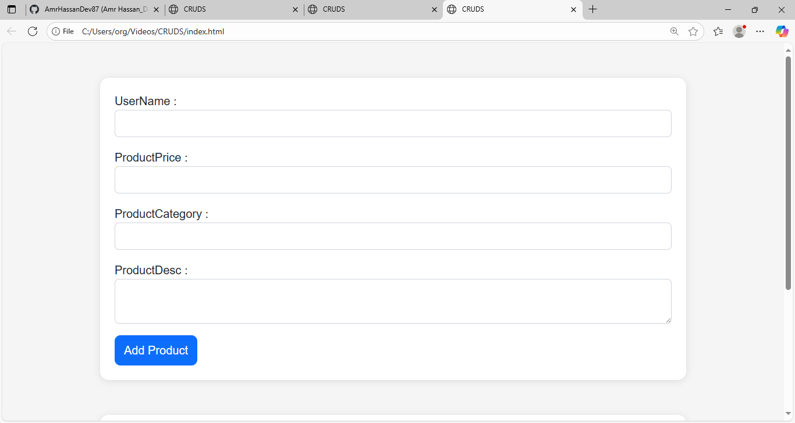
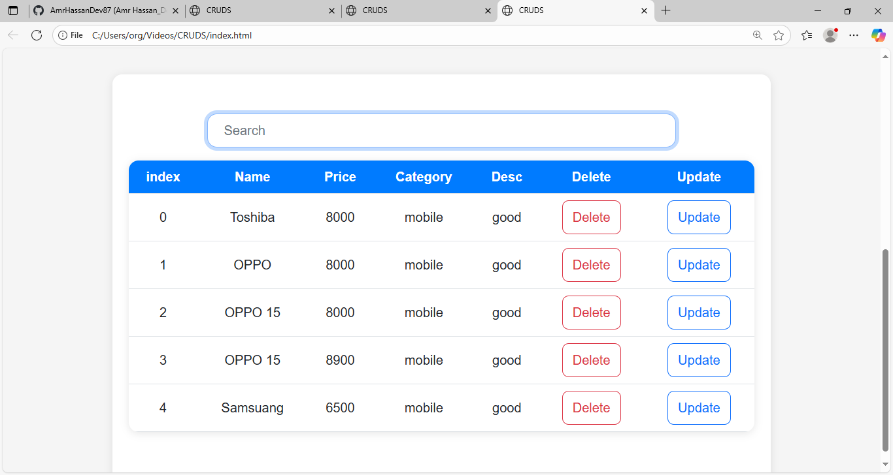

# 🛒 CRUDS Product Management System  

📌 A simple **Product Management System** built with **HTML, CSS, Bootstrap, and JavaScript**.  
This project allows users to **Create, Read, Update, and Delete (CRUD)** products easily.  

👉 **[Click here to Live View Website](https://amrhassandev87.github.io/CRUDS-Product-Management-System/)**  

 

---

## 🚀 Features  
- ➕ Add new products  
- ✏️ Update existing products  
- 🗑️ Delete products  
- 🔍 Search products by name  
- 💾 Data saved in localStorage  

---

## 🛠️ Technologies Used  
- **HTML5** – Structure  
- **CSS3** – Styling  
- **Bootstrap** – Responsive design  
- **JavaScript (ES6)** – Logic & Functionality  

---

## 📸 Screenshots  

### 🖼️ Main Page  
  

### 🖼️ Add Product  
  

---

## 📬 Contact  
👤 **Amr Hassan**  
- GitHub: [amrhassandev87](https://github.com/amrhassandev87)  
